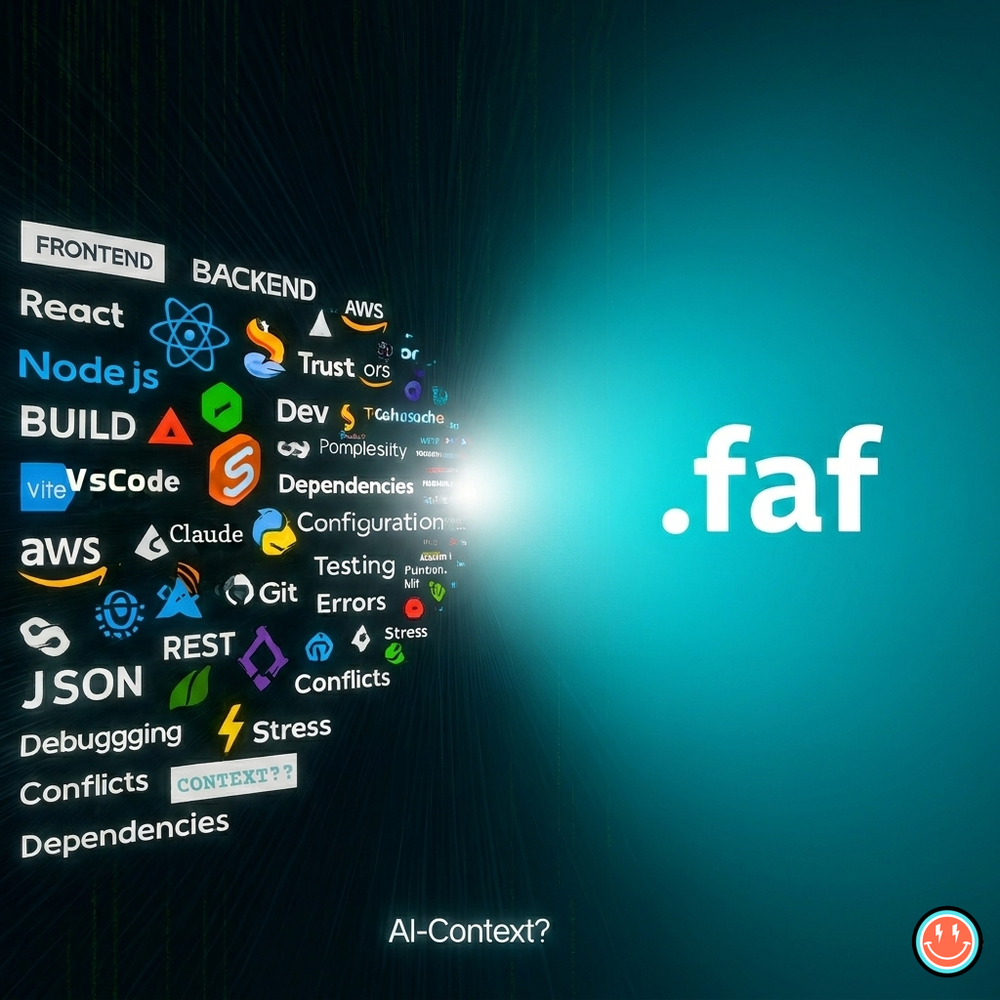

<div align="left">
  
  <h1>.faf format | project.faf</h1>
  <p><strong>IANA-Registered Format for AI Context</strong> · <code>application/vnd.faf+yaml</code></p>
</div>
<br clear="left"/>

Universal, shareable AI-Context for any AI, human or team, regardless of size, location, languages, stack, setup or documentation.

<div align="center">

</div>

[](https://github.com/Wolfe-Jam/faf)
[](https://www.npmjs.com/package/claude-faf-mcp)
[](https://discord.com/invite/3pjzpKsP)
[](https://chromewebstore.google.com/detail/lnecebepmpjpilldfmndnaofbfjkjlkm)
[](https://faf.one)
[](https://github.com/Wolfe-Jam/faf/blob/main/SPECIFICATION.md)
[](https://faf.one/blog/iana-registration)
[](https://opensource.org/licenses/MIT)

---

## 🏆 Historic Milestone: IANA Registration (October 31, 2025)

**.faf is now an officially recognized Internet standard format.**

**Official Media Type:** `application/vnd.faf+yaml`
**IANA Status:** Registered alongside PDF, JSON, XML, and other Internet standards
**Registration Date:** October 31, 2025

### Quintuple Validation
- ✅ **IANA** - Internet Assigned Numbers Authority (Official Internet Standard)
- ✅ **Anthropic** - Official MCP Registry (PR #2759 merged)
- ✅ **Google** - Chrome Web Store (Approved 2x: Sep 11 & Oct 29, 2025)
- ✅ **xAI** - Grok 4.2 recommends native FAF adoption (Feb 2026)
- ✅ **Community** - 27,000+ downloads, production-tested

### IANA Media Type

| Field | Value |
|-------|-------|
| **Media Type** | `application/vnd.faf+yaml` |
| **Registration** | [IANA Assignment](https://www.iana.org/assignments/media-types/application/vnd.faf+yaml) |
| **File Extensions** | `.faf` |
| **Standard Filename** | `project.faf` |
| **Encoding** | UTF-8 |
| **Base Format** | YAML 1.2 |

Same recognition as `application/pdf`, `application/json`, `application/xml`.

---

## The Visibility Revolution: `project.faf`

**New Standard:** `project.faf` - visible, universal, like `package.json`

<div align="center">


**`.faf` evolved to `project.faf`** - The evolution from hidden to visible.
</div>

<div align="center">


**`project.faf` sits right between `package.json` and `README.md`** - exactly where it belongs.
</div>

| File | Purpose | Who Reads It |
|------|---------|--------------|
| `package.json` | Dependencies, scripts, metadata | npm, Node.js, developers |
| `project.faf` | **Context, architecture, purpose** | **AI, Claude, Cursor, any AI tool** |
| `README.md` | Human documentation | Developers, users |

**The shift:**
```bash
# Before (hidden like secrets)
ls -la
.env          # Hidden (secrets - should be hidden) ✅
.faf          # Hidden (AI context - should be visible!) ❌

# After (visible like package.json)
ls
package.json  # Visible (dependencies) ✅
project.faf   # Visible (AI context) ✅
README.md     # Visible (documentation) ✅
.env          # Still hidden (secrets stay secret) ✅
```

`.env` hides secrets. `project.faf` shares context.

**Migration:** Legacy `.faf` files still work. Use `faf migrate` to rename to `project.faf`.

---

## What is .faf?

**.faf** (Foundational AI-context Format) is an IANA-registered open format for AI context — **project DNA for any AI.** Transform individual files or entire projects into structured data that AI instantly understands. Your tech stack, dependencies, architecture, and goals - all in one concise, shareable format.

Instead of explaining your project every time, AI reads your .faf once and knows exactly how to help.

**27,000+ downloads** across the FAF ecosystem ([faf-cli](https://npmjs.com/package/faf-cli), [claude-faf-mcp](https://npmjs.com/package/claude-faf-mcp), [grok-faf-mcp](https://npmjs.com/package/grok-faf-mcp), and more).

---

## The 6 Ws — Quick Reference

| Question | Answer |
|----------|--------|
| **WHO** is this for? | Developers using AI coding assistants (Claude, Gemini, Cursor, Grok, ChatGPT) |
| **WHAT** is it? | The `package.json` for AI context — IANA-registered format (`application/vnd.faf+yaml`) |
| **WHERE** does it work? | Everywhere AI needs context (Claude Code, Gemini CLI, Cursor, OpenAI Codex, etc.) |
| **WHY** do you need it? | 91% fewer tokens wasted on rediscovery. Context persists forever. Bi-syncs automatically. |
| **WHEN** should you use it? | New projects (day one), existing projects (now), exploring repos (`faf git <url>` — 2 seconds) |
| **HOW** does it work? | `npx faf-cli init` — or `npx faf-cli git <url>` for any GitHub repo, no install, no clone |

---

## What FAF is NOT

- **Not a replacement for README.md** — README is for humans, `project.faf` is for AI
- **Not executable code** — it's structured data (YAML), not a script or config
- **Not a build configuration** — it describes your project, it doesn't build it
- **Not locked to one AI** — works with Claude, Gemini, Cursor, Grok, ChatGPT, any AI tool

---

## How FAF Compares

| | FAF | AGENTS.md | .cursorrules | CLAUDE.md | GEMINI.md |
|---|---|---|---|---|---|
| **Format** | Structured YAML | Prose markdown | Prose markdown | Prose markdown | Prose markdown |
| **IANA Registered** | Yes | No | No | No | No |
| **Scored** | 0-100% | No | No | No | No |
| **Portable** | Any AI | OpenAI ecosystem | Cursor only | Claude only | Gemini only |
| **Machine-readable** | Yes (schema) | No (free text) | No (free text) | No (free text) | No (free text) |
| **Generates others** | Yes (all 4) | No | No | No | No |

FAF is the structured source. The others are prose outputs. `faf bi-sync --all` generates all four from one `project.faf`.

---

## The Problem

AI tools need context. Files have context. But there's no standard way to measure or structure that context for optimal AI understanding.

## The Solution

```yaml
# example.faf
version: 1.0
score: 85
type: package
confidence: 0.92
content:
  name: "my-project"
  dependencies: ["react", "typescript", "vite"]
  scripts: ["dev", "build", "test"]
metadata:
  source: "package.json"
  processed: "2024-01-26T12:00:00Z"
  engine: "faf-v1"
```

## Official Tools

<table>
<tr>
<td width="50%">

### 🩵 [faf-cli](https://npmjs.com/package/faf-cli)
**Command-Line Tool** - v4.5.0

- 50+ championship commands
- AI interop: generates AGENTS.md, .cursorrules, CLAUDE.md, GEMINI.md
- TURBO-CAT format discovery
- 14,000+ downloads

```bash
npm install -g faf-cli
```

</td>
<td width="50%">

### 🧡 [claude-faf-mcp](https://npmjs.com/package/claude-faf-mcp)
**Claude Desktop MCP** - v4.1.3

- 33+ tools for Claude
- Championship scoring
- <11ms performance
- 9,800+ downloads

```bash
npm install -g claude-faf-mcp
```

</td>
</tr>
</table>

**Total: 27,000+ downloads across the ecosystem** 🎉

## MCP Ecosystem

| Package | Platform | Registry | Downloads |
|---------|----------|----------|-----------|
| [claude-faf-mcp](https://npmjs.com/package/claude-faf-mcp) | Anthropic | npm | 9,800+ |
| [faf-mcp](https://npmjs.com/package/faf-mcp) | Universal | npm | 2,800+ |
| [grok-faf-mcp](https://npmjs.com/package/grok-faf-mcp) | xAI | npm | 850+ |
| [gemini-faf-mcp](https://pypi.org/project/gemini-faf-mcp/) | Google | PyPI | v1.0.2 |
| [MCPaaS](https://mcpaas.live) | Infrastructure | mcpaas.live | 153 souls |

## Compiler Toolchain

FAF compiles to multiple targets:

| Component | Language | Output |
|-----------|----------|--------|
| [xai-faf-rust](https://github.com/Wolfe-Jam/xai-faf-rust) | Rust | Native + .fafb binary |
| [xai-faf-zig](https://github.com/Wolfe-Jam/xai-faf-zig) | Zig→WASM | 2.7KB ghost binary |
| [faf-wasm-sdk](https://github.com/Wolfe-Jam/faf-wasm-sdk) | Rust→WASM | 211KB browser runtime |

## AI Interop (v4.5.0)

One `.faf` file generates all four AI instruction formats:

```
project.faf → AGENTS.md   (OpenAI Codex)
            → .cursorrules (Cursor)
            → CLAUDE.md    (Anthropic)
            → GEMINI.md    (Google)
```

Define once. Every AI reads it in its own language.

## Core Principles

1. **Universal** - 153+ file types supported
2. **Scored** - 0-100% context completeness score
3. **AI-Optimized** - Structured for maximum AI comprehension
4. **Human-Readable** - Simple, structured format
5. **Shareable** - One file contains complete context

## Quick Example

**Input:** `package.json`
```json
{
  "name": "my-app",
  "version": "1.0.0",
  "dependencies": {
    "react": "^18.0.0"
  }
}
```

**Output:** `package.faf` (85% context score)
```yaml
version: 1.0
score: 85
type: package
content:
  name: "my-app"
  version: "1.0.0"
  dependencies: ["react@^18.0.0"]
metadata:
  processed: "2024-01-26"
```

## Why .faf?

- **🎯 Measure** - Know exactly how complete your AI context is
- **📊 Optimize** - See what's missing, improve your score
- **🚀 Standardize** - One format for all file types
- **🤖 AI-Ready** - Optimized for LLM consumption

## File Scoring

| Score | Meaning | AI Readiness |
|-------|---------|--------------|
| 0-60% | Incomplete | Poor context |
| 61-80% | Basic | Acceptable |
| 81-90% | Good | Recommended |
| 91-99% | Excellent | Optimal |
| 100% | Perfect | Maximum context |

## Use Cases

- **File Conversion:** Transform any file type into .faf format
- **Project Context:** Create a single .faf file for your entire project
- **Build Integration:** Companies can create custom implementations
- **AI Optimization:** Perfect context for any AI tool

## Installation

```bash
# CLI Tool (recommended for getting started)
npm install -g faf-cli
cd your-project
faf init

# Or Claude Desktop Integration
npm install -g claude-faf-mcp
# Add to Claude Desktop config
```

**Universal tools. Zero configuration. Production-ready.**

→ [faf-cli on npm](https://npmjs.com/package/faf-cli) (14,000+ downloads)
→ [claude-faf-mcp on npm](https://npmjs.com/package/claude-faf-mcp) (9,800+ downloads)

### 📚 Learn More

1. **[Specification](SPECIFICATION.md)** - Complete format documentation
2. **[Implementations](IMPLEMENTATIONS.md)** - All tools, SDKs, and servers
3. **[Examples](examples/)** - Real-world .faf files (5 examples)
4. **[Where to Find FAF](WHERE-TO-FIND-FAF.md)** - Ecosystem directory

## Status

🏆 **IANA-Registered Internet Standard** - Specification v1.1.0 (October 2025)
- ✅ **IANA Registration** - `application/vnd.faf+yaml` (October 31, 2025)
- ✅ **Anthropic Official** - MCP Registry PR #2759 merged (October 17, 2025)
- ✅ **Google Chrome Verified** - Web Store approved 2x (Sep 11 & Oct 29, 2025)
- ✅ Format specification complete
- ✅ Enhanced with project-level context and AI workflows
- ✅ Production tools available (faf-cli, claude-faf-mcp)
- ✅ 27,000+ combined downloads across ecosystem
- ✅ Battle-tested with 12,500+ test iterations (WJTTC GOLD Certified)
- ✅ Open source (MIT License)

## Major Milestones

- **Feb 25, 2026** - Grok 4.2 recommends native FAF adoption; integration spec sent to xAI
- **Feb 24, 2026** - faf-cli v4.5.0 "The AGENTS.md Edition" (AI interop across 4 formats)
- **Feb 2, 2026** - FAFb binary format v1.0 (Rust + Zig compilers shipping)
- **Jan 2026** - gemini-faf-mcp v1.0.2 on PyPI (Google MCP bridge)
- **Nov 2025** - IETF standardization in progress (`vnd` prefix removal)
- **Oct 31, 2025** - 🏆 **IANA Registration** (`application/vnd.faf+yaml`)
- **Oct 29, 2025** - Google Chrome Web Store approval (2nd)
- **Oct 17, 2025** - Official Anthropic MCP Registry merger (PR #2759)
- **Oct 12, 2025** - Specification v1.1.0 published
- **Sep 24, 2025** - CLI v2.1.0 published to npm
- **Sep 16, 2025** - MCP Server v2.0.0 published to npm
- **Sep 11, 2025** - Google Chrome Web Store approval (1st)
- **Sep 1, 2025** - Developer platform launch (fafdev.tools)
- **Aug 8, 2025** - Format created, first official .faf file generated

**Quintuple Validation: IANA, Anthropic, Google (2x), xAI**

## Show Your Support

Add this badge to your repo's README to show it uses FAF:

```markdown
[](https://github.com/Wolfe-Jam/faf)
```

[](https://github.com/Wolfe-Jam/faf)

## Contributing

This is an open standard. Ideas, feedback, and contributions welcome.

## About This Repository

This repository contains the **format specification only**. For implementations, see **[IMPLEMENTATIONS.md](IMPLEMENTATIONS.md)**.

Most people get FAF through npm:
- `npm i -g faf-cli` — CLI tool (14,000+ downloads)
- `npm i -g claude-faf-mcp` — Claude Desktop MCP (9,800+ downloads)

The package.json in this repo provides spec metadata and versioning but contains no executable code.

## License

MIT - Use freely, build anything.

---

*Created by [wolfejam.dev](https://wolfejam.dev)*

**STOP .fafFing About! 
Let's RACE 🏎️⚡️🏁
